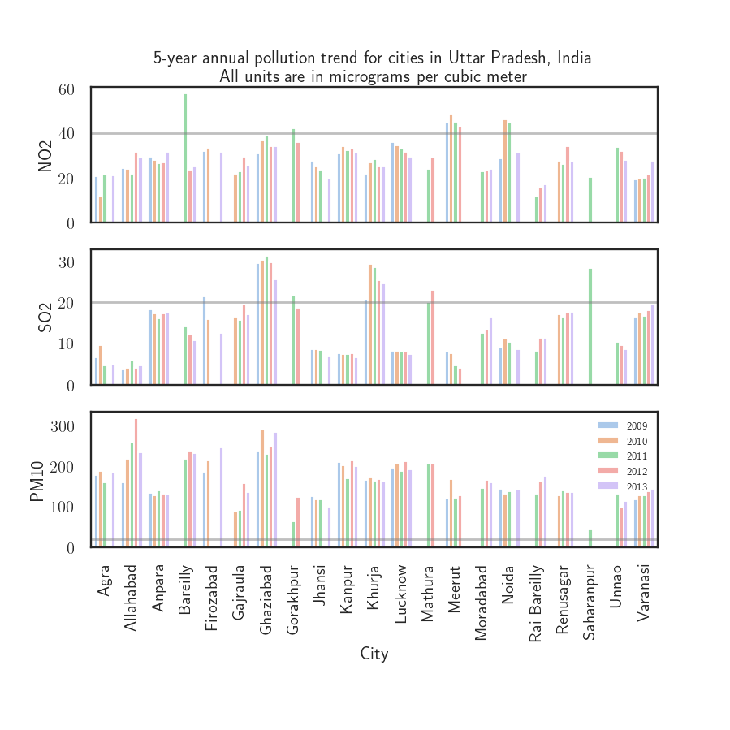

#### Description:
        Applied Plotting, Charting and Data Representation in Python Week 4 Assignment

1. **Region and Domain**
        Cities in state of Uttar Pradesh, India 
        Pollution trends from 2009-2013 
2. **Research Question**
        How have the pollution indicators of Particulate matter (PM), Sulphur Dioxide (SO2) and
        Nitrogen Dioxide (NO2) faired in all the cities in this state over a 5 year period. 
3. **Links**
        5 data files each for the years 2009-2013 were obtained from the Indian govt website 
        [data.gov.in](https://data.gov.in/catalog/historical-daily-ambient-air-quality-data?filters%5Bfield_catalog_reference%5D=1140581&format=json&offset=0&limit=6&query=uttar+pradesh&sort%5B_score%5D=desc) as .csv files. 
        The 5 annual data files have also been uploaded to [Github](www.github.com)
4. **Image**
        
        
5. **Discussion**
        The question was to find the pollution trends for the cities in the state of Uttar Pradesh in India. As the attached graphic makes obvious the indicators are quite high compared to the WHO guidelines (horizontal lines) especially for particulate matter (PM10). For PM10 the WHO guideline is an annual average value of 20 micrograms per cubic meter of ambient air. Some of the cities like Allahabad and Ghaziabad (a suburb of Delhi) have 10 - 15 times the WHO value! Cities like Lucknow, Kanpur and Faizabad also have PM10 values around 200 which is very high. The graph also shows annual trends of these indicators and they seem to be either rising or about the same. 
        The data was collected from 5 years of daily pollution data for the years 2009-2013. PM2.5 was measured in India only after 2013 and therefore was not available. This was then averaged annually by city and merged together into one dataset.  

6. **Design Choices** 
        The seaborn library was used to create the barplots. A white background was chosen and the intermediate X labels and legends for the upper sub-plots were removed. The legend for the bottom sub-plot was placed in the best location available without overlaying the data. The X tick labels were rotated 90 degrees to easily fit the city names and visually distinguish them from each other. 
        A pastel color palette was picked for the years to be easy on the eyes and show the yearly changesmore clearly. An alpha of 0.5 and grey color was picked for the horizontal lines so that the bars could still be seen clearly. A title explaining the plot was added.  
